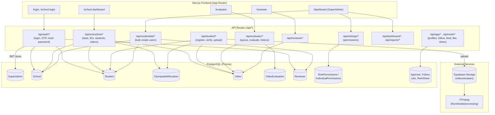
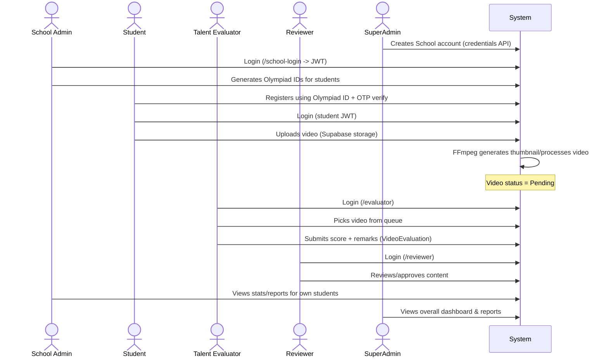
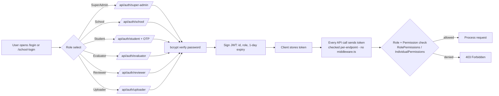

# Olympiad App — Poora Workflow Diagram

## 1. High-Level Architecture (Roles + System)

```mermaid
flowchart TB
    subgraph Frontend["Next.js Frontend (App Router)"]
        Login["/login, /school-login"]
        SchoolUI["/school dashboard"]
        AdminUI["/dashboard (SuperAdmin)"]
        EvalUI["/evaluator"]
        RevUI["/reviewer"]
    end

    subgraph API["API Routes (/api/*)"]
        AuthAPI["/api/auth/*\n(login, OTP, reset password)"]
        SchoolAPI["/api/school/me/*\n(stats, IDs, students, videos)"]
        StudentAPI["/api/student/*\n(register, verify, upload)"]
        EvalAPI["/api/evaluator/*\n(queue, evaluate, history)"]
        RevAPI["/api/reviewer/*"]
        AppAPI["/api/app/* , /api/reels/*\n(profiles, follow, feed, like, share)"]
        CredAPI["/api/credentials/*\n(bulk create users)"]
        DashAPI["/api/dashboard/*, /api/reports/*"]
        SettingsAPI["/api/settings/*\n(permissions)"]
    end

    subgraph Services["External Services"]
        Supabase[("Supabase Storage\n(videos/avatars)")]
        FFmpeg["FFmpeg\n(thumbnails/processing)"]
    end

    subgraph DB["PostgreSQL (Prisma)"]
        SuperAdminT[(SuperAdmin)]
        SchoolT[(School)]
        StudentT[(Student)]
        OlyIdT[(OlympiadIdAllocation)]
        VideoT[(Video)]
        EvalT[(VideoEvaluation)]
        ReviewerT[(Reviewer)]
        PermsT[(RolePermissions /\nIndividualPermissions)]
        SocialT[(AppUser, Follow,\nLike, ReelShare)]
    end

    Login --> AuthAPI
    SchoolUI --> SchoolAPI
    AdminUI --> DashAPI
    AdminUI --> CredAPI
    AdminUI --> SettingsAPI
    EvalUI --> EvalAPI
    RevUI --> RevAPI

    AuthAPI -->|JWT issue| SuperAdminT
    AuthAPI --> SchoolT
    AuthAPI --> StudentT
    AuthAPI --> ReviewerT

    SchoolAPI --> SchoolT
    SchoolAPI --> StudentT
    SchoolAPI --> OlyIdT
    SchoolAPI --> VideoT

    StudentAPI --> StudentT
    StudentAPI --> OlyIdT
    StudentAPI -->|upload| Supabase
    Supabase --> FFmpeg
    StudentAPI --> VideoT

    EvalAPI --> VideoT
    EvalAPI --> EvalT

    RevAPI --> VideoT

    AppAPI --> SocialT
    CredAPI --> SchoolT
    CredAPI --> StudentT
    CredAPI --> ReviewerT
    SettingsAPI --> PermsT
```

## 2. End-to-End Student Olympiad Journey

```mermaid
sequenceDiagram
    actor School as School Admin
    actor Student
    actor Evaluator as Talent Evaluator
    actor Reviewer
    actor SuperAdmin

    SuperAdmin->>System: Creates School account (credentials API)
    School->>System: Login (/school-login -> JWT)
    School->>System: Generates Olympiad IDs for students
    Student->>System: Registers using Olympiad ID + OTP verify
    Student->>System: Login (student JWT)
    Student->>System: Uploads video (Supabase storage)
    System->>System: FFmpeg generates thumbnail/processes video
    Note over System: Video status = Pending

    Evaluator->>System: Login (/evaluator)
    Evaluator->>System: Picks video from queue
    Evaluator->>System: Submits score + remarks (VideoEvaluation)

    Reviewer->>System: Login (/reviewer)
    Reviewer->>System: Reviews/approves content

    School->>System: Views stats/reports for own students
    SuperAdmin->>System: Views overall dashboard & reports
```

## 3. Auth Flow (JWT-based, role-specific)

```mermaid
flowchart LR
    U[User opens /login or /school-login] --> R{Role select}
    R -->|SuperAdmin| A1[/api/auth/super-admin/]
    R -->|School| A2[/api/auth/school/]
    R -->|Student| A3[/api/auth/student + OTP/]
    R -->|Evaluator| A4[/api/auth/evaluator/]
    R -->|Reviewer| A5[/api/auth/reviewer/]
    R -->|Uploader| A6[/api/auth/uploader/]

    A1 & A2 & A3 & A4 & A5 & A6 --> J[bcrypt verify password]
    J --> K[Sign JWT: id, role, 1-day expiry]
    K --> L[Client stores token]
    L --> M[Every API call sends token\nchecked per-endpoint - no middleware.ts]
    M --> N{Role + Permission check\nRolePermissions / IndividualPermissions}
    N -->|allowed| O[Process request]
    N -->|denied| P[403 Forbidden]
```
